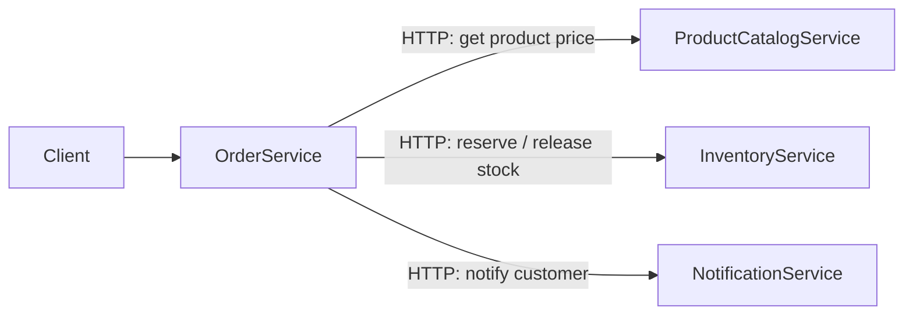

# 🧩 Phase 2 — Task 2.1: Microservices Structural Plan

This is the **design** for splitting the monolith (`OrderManagementAPI`) into 4 independent
services. No code is moved yet — this document defines the target layout, who owns what, and how
the services will talk to each other.

> **Migration strategy — Strangler Fig (from the teacher's `04-microservices` material):**
> we keep the monolith running and "peel off" one service at a time, instead of a risky big-bang
> rewrite. Each task (2.2 → 2.3 → 2.4) extracts one slice until the monolith is gone.
> 🇮🇱 גישת ה-Strangler Fig: מפרקים שירות אחד בכל פעם והמונולית ממשיך לעבוד עד שמסיימים.

---

## 1. Target Repository Layout

Each service is its **own .NET 8 project** (one `.csproj`) with clean, layered folders. Services
are siblings at the repo root, and **one root `docker-compose.yml`** runs everything.

```text
ProjectAi/
├── docker-compose.yml              # single command starts ALL services + their databases
├── OrderManagementAPI/             # the original monolith (kept until migration completes)
│
├── ProductCatalogService/          # Task 2.2  → MongoDB (document DB)
│   ├── Controllers/                #   HTTP endpoints (was ProductsController)
│   ├── Services/                   #   business logic (was ProductService)
│   ├── Models/                     #   Product entity + request/response DTOs
│   ├── Data/                       #   MongoDB client/context
│   ├── Program.cs
│   ├── Dockerfile
│   └── ProductCatalogService.csproj
│
├── OrderService/                   # Task 2.3  → SQL Server (relational, ACID)
│   ├── Controllers/                #   was OrdersController
│   ├── Services/                   #   was OrderService
│   ├── Models/                     #   Order, OrderItem + DTOs
│   ├── Data/                       #   EF Core DbContext (orders only)
│   ├── Program.cs
│   ├── Dockerfile
│   └── OrderService.csproj
│
├── InventoryService/               # Task 2.3  → own database (family decided in 2.3)
│   ├── Controllers/                #   was InventoryController
│   ├── Services/                   #   was InventoryService
│   ├── Models/                     #   Inventory + DTOs
│   ├── Data/
│   ├── Program.cs
│   ├── Dockerfile
│   └── InventoryService.csproj
│
├── NotificationService/            # Task 2.4  → no database (stateless; logs now, messages later)
│   ├── Controllers/
│   ├── Services/                   #   was NotificationService
│   ├── Models/
│   ├── Program.cs
│   ├── Dockerfile
│   └── NotificationService.csproj
│
└── Shared/                         # shared contracts ONLY (DTOs now, event classes in Phase 4)
    └── Contracts/                  #   e.g. ReserveStockRequest, OrderPlaced event
```

> 🇮🇱 כל שירות = פרויקט עצמאי עם תיקיות שכבתיות (Controllers/Services/Models/Data), וקובץ
> docker-compose אחד מריץ את כולם יחד.

---

## 2. Service Responsibilities & Migration Mapping

What moves out of the monolith into each service:

| New Service | Owns (domain) | Moved from monolith | Database | Built in |
|---|---|---|---|---|
| **ProductCatalogService** | Product catalog (browse/manage products) | `ProductsController`, `ProductService`, `Product` | **MongoDB** (document) | Task 2.2 |
| **OrderService** | Orders & order items, order lifecycle | `OrdersController`, `OrderService`, `Order`, `OrderItem` | **SQL Server** (relational) | Task 2.3 |
| **InventoryService** | Stock reserve/release | `InventoryController`, `InventoryService`, `Inventory` | **own DB — family chosen in Task 2.3** | Task 2.3 |
| **NotificationService** | Notify customer (confirmed/rejected) | `NotificationService` | **none** (stateless) | Task 2.4 |

**Database-per-service rule:** each service owns its data and **no service reads another
service's database**. If `OrderService` needs product or stock data, it asks the owning service
over the network — never via a shared DB or shared `DbContext`.
> 🇮🇱 כל שירות מחזיק את בסיס הנתונים שלו בלבד. שירות לא נוגע ב-DB של שירות אחר — מבקשים מידע דרך ה-API.

---

## 3. How the Services Talk (Phase 2 vs. Phase 4)

The monolith does this **in-process** today; after the split it crosses the network.



- **Phase 2 (now):** synchronous **HTTP** calls between services — simplest way to get an
  end-to-end order working again after the split (Task 2.4 checkpoint).
- **Phase 4 (later):** these synchronous calls are replaced by **asynchronous events** over a
  message broker (the Order Saga). The `Shared/Contracts` folder is where those event classes will
  live, so we create it now to avoid duplicating DTOs across services.

> 🇮🇱 בשלב 2 התקשורת בין השירותים היא HTTP סינכרוני (פשוט, לבדיקה מקצה-לקצה). בשלב 4 נחליף זאת
> באירועים אסינכרוניים דרך תור הודעות (Saga).

---

## 4. Why this layout (architectural justification)

- **One project per service with layered folders** — keeps each service small and independently
  deployable/containerizable, without the overhead of 16 sub-projects. It mirrors the monolith's
  existing style, so moving code is mostly *relocation*, not rewriting.
- **A service per bounded context** — Product, Order, Inventory, Notification are natural DDD
  bounded contexts (we identified them in the Phase 1 diagram). Splitting on these lines means each
  team/service can scale and evolve independently — directly solving **Bottleneck #1** (shared DB)
  and **#2** (in-process coupling) from `PHASE1-ARCHITECTURE.md`.
- **`Shared/Contracts` for DTOs/events only** — shared *contracts* are fine; shared *databases* are
  not. Keeping only data-shape contracts here preserves service independence.

---

### ✔ Task 2.1 status
This plan defines the 4 target services, their owned data, their folder layout, and their
communication model. **No code has moved yet** — that begins in **Task 2.2** (extract
`ProductCatalogService` onto MongoDB), following the Strangler Fig approach.

**Open decision deferred to Task 2.3:** the database *family* for `InventoryService` (relational vs.
a key-value/other NoSQL store) — we'll justify it with an ADR when we get there.
