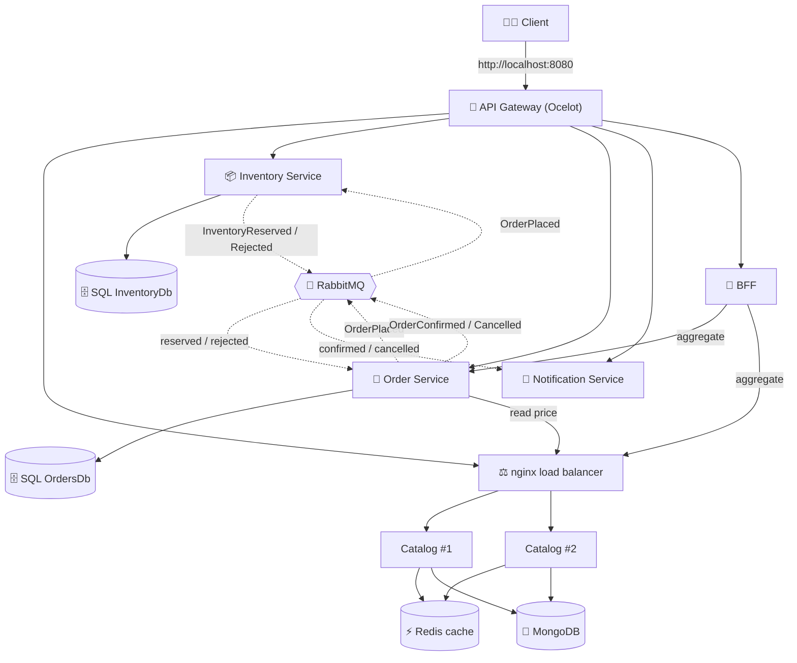

# 🛒 Order Management — Microservices

A production-style **e-commerce order system** built for the Architecture course, evolved from a
single monolith into a distributed microservices platform with an **API Gateway**, a **BFF**,
**polyglot persistence**, a **load-balanced** service, an **event-driven saga** over RabbitMQ, and
a **Redis cache**, and full **observability** (Serilog → Seq, health checks, correlation-ID tracing).

> **Status:** ✅ **All 5 phases complete** — Monolith baseline → Microservices split → Gateway/BFF/Load
> Balancing → Async messaging, Saga & Caching → Observability.

---

## 📖 Project Overview

The system supports the core capabilities of an order platform:

- **Browse products** (catalog)
- **Place an order** (which reserves stock and calculates totals)
- **Reserve / release inventory**
- **Notify the customer** when an order is confirmed or rejected

It is split into **four business services** plus two infrastructure services (a gateway and a
backend-for-frontend), each independently deployable and owning its own data.

---

## 🏗️ Architecture (Phases 1–5)

Solid arrows = synchronous HTTP (through the gateway / for reads). Dashed arrows = **asynchronous
events** over RabbitMQ (the order saga).



### The journey (what each phase added)

| Phase | Milestone | Highlights |
|---|---|---|
| **1** | Monolith baseline | One .NET 8 Web API + one SQL Server, containerized with docker-compose |
| **2** | Microservices split | 4 services, **database-per-service**, **polyglot persistence** (Mongo + SQL), ADRs |
| **3** | Gateway, BFF & LB | **Ocelot** gateway (single entry), **BFF** aggregation, **nginx** load balancer over 2 catalog replicas |
| **4** | Messaging, Saga & Cache | **RabbitMQ** event bus, choreography **saga** (reserve → confirm/compensate → notify), idempotent consumers, **Redis** cache-aside on catalog reads |
| **5** | Observability | **Serilog** structured logs → **Seq** dashboard, `/health` endpoints wired into compose healthchecks, **correlation ID** that follows one order across every service *and through RabbitMQ* |

### The services

| Service | Responsibility | Data store | Consistency |
|---|---|---|---|
| **ProductCatalogService** | Product catalog (browse/manage) | **MongoDB** (document) | BASE |
| **OrderService** | Orders & order lifecycle | **SQL Server** (`OrdersDb`) | ACID |
| **InventoryService** | Stock reserve/release | **SQL Server** (`InventoryDb`) | ACID |
| **NotificationService** | Customer notifications | none (stateless) | — |
| **API Gateway** (Ocelot) | Single public entry point, routing | — | — |
| **BFF** | Aggregates order + catalog into one response | — | — |

> Full database justifications (ACID / BASE / CAP) are in [ADR.md](ADR.md).
> The Phase-1 diagram/endpoints live in [PHASE1-ARCHITECTURE.md](PHASE1-ARCHITECTURE.md); the split
> plan in [PHASE2-MICROSERVICES-PLAN.md](PHASE2-MICROSERVICES-PLAN.md).

---

## 🔌 Port Mapping

Clients only need the **gateway (8080)**. The other ports are exposed for development/Swagger.

| Component | Host port | Container | Tech |
|---|---|---|---|
| **API Gateway** (public entry) | **8080** | 8080 | Ocelot / .NET 8 |
| Product Catalog (via nginx LB → 2 replicas) | 8081 | 8080 | nginx + .NET 8 + MongoDB |
| Inventory Service | 8082 | 8080 | .NET 8 + SQL Server |
| Order Service | 8083 | 8080 | .NET 8 + SQL Server |
| Notification Service | 8084 | 8080 | .NET 8 |
| BFF | 8085 | 8080 | .NET 8 |
| SQL Server | 1433 | 1433 | `OrdersDb` + `InventoryDb` |
| MongoDB | 27017 | 27017 | `ProductCatalogDb` |
| RabbitMQ | 5672 (broker) / **15672** (UI) | 5672 / 15672 | event bus; UI login `guest`/`guest` |
| Redis | 6379 | 6379 | catalog cache (shared by both replicas) |
| **Seq** (logs dashboard) | **5341** | 80 | centralized structured logs; no login |

---

## 🚀 Run Everything (one command)

**Prerequisite:** Docker Desktop.

```bash
docker compose up --build
```

That builds and starts **all** services and their databases. Docker waits for SQL Server and
MongoDB health checks before starting the apps. First run takes a few minutes (image pulls/builds).

Then everything is reachable through the gateway at **http://localhost:8080**.

**Stop:**
```bash
docker compose down          # stop (keeps data in volumes)
docker compose down -v       # stop AND wipe databases (fresh start)
```

---

## ✅ Quick end-to-end test (through the gateway)

> 💡 Demo products are **pre-seeded** — you can skip steps 1–2 and go straight to step 3 using the
> seeded id `6a43dd44026dfff7e9bc6382`. A full step-by-step demo script is in
> **[TESTING-GUIDE.md](TESTING-GUIDE.md)**.

```bash
# 1) Create a product (note the returned "id")
curl -X POST http://localhost:8080/api/products -H "Content-Type: application/json" \
  -d '{"name":"Demo Mug","description":"Ceramic mug","category":"Kitchen","price":15.00,"attributes":{"Color":"White"}}'

# 2) Give it stock (use the id from step 1)
curl -X POST http://localhost:8080/api/inventory/initialize -H "Content-Type: application/json" \
  -d '{"productId":"<PASTE_ID>","quantity":100}'

# 3) Place an order. It comes back as Pending (status 0) - the SAGA then reserves stock and
#    auto-confirms it a moment later (no manual approval needed).
curl -X POST http://localhost:8080/api/orders -H "Content-Type: application/json" \
  -d '{"items":[{"productId":"<PASTE_ID>","quantity":2}]}'

# 4) A second later, read it back -> "status": 1 (Approved), confirmed by the saga
curl http://localhost:8080/api/orders/<ORDER_ID>

# 5) See the aggregated view (BFF: order + product names in one response)
curl http://localhost:8080/api/order-details/<ORDER_ID>

# 6) See the notification the saga sent
curl http://localhost:8080/api/notifications
```

### See the saga's compensation (failure) path
Order more than the available stock — the saga auto-**rejects** the order and notifies the customer,
without leaking any reserved stock:

```bash
curl -X POST http://localhost:8080/api/orders -H "Content-Type: application/json" \
  -d '{"items":[{"productId":"<PASTE_ID>","quantity":100000}]}'
# read the order back -> "status": 2 (Rejected), with the reason in "notes"
```

Watch the whole saga live in the logs, and the exchanges/queues in the RabbitMQ UI
(**http://localhost:15672**, `guest`/`guest`):
```bash
docker compose logs -f order inventory notification
```

### See the load balancer + shared cache in action
The catalog runs as **two replicas** behind nginx (each response has an `X-Instance` header), and both
share one **Redis** cache. Read the same product a few times and watch the logs: the first read is a
`MISS` (loaded from Mongo), the rest are `HIT`s — even across different replicas.

```bash
curl -s -D - http://localhost:8081/api/products/<PASTE_ID> -o /dev/null | grep -i x-instance
docker compose logs productcatalog1 productcatalog2 | grep -iE "cache (hit|miss)"
```

---

## 🧰 Tech Stack

- **.NET 8** Web API (all services)
- **Ocelot** — API Gateway
- **nginx** — load balancer (Docker-DNS round-robin across replicas)
- **SQL Server 2022** — relational store (orders, inventory) via **EF Core 8**
- **MongoDB 7** — document store (product catalog) via the **MongoDB .NET driver**
- **RabbitMQ** — message broker for the event-driven order saga (via `RabbitMQ.Client`)
- **Redis 7** — distributed cache (cache-aside on catalog reads, via `StackExchange.Redis`)
- **Serilog + Seq** — structured logging aggregated into one searchable dashboard
- **Docker Compose** — one-command orchestration

---

## 🔭 Observability (Phase 5)

- **Structured logging:** every service logs with **Serilog** and ships to **Seq**
  (http://localhost:5341). Each event carries `Service` and `CorrelationId` properties, so the whole
  system is searchable in one place.
- **Health checks:** each service exposes **`/health`**, wired into docker-compose healthchecks
  (`docker compose ps` shows services as `healthy`).
- **Correlation ID:** an `X-Correlation-ID` is created per order and **propagated across every service
  *and through RabbitMQ***, so one Seq filter (`CorrelationId = '...'`) reconstructs an order's entire
  journey — placed → reserved → confirmed → notified.

## 🌱 Data Seeding (portable demo data)

On first startup with empty databases, the system **auto-seeds** demo products (catalog / MongoDB) and
matching stock (inventory / SQL Server) — so a fresh clone works immediately after `docker compose up`,
with no manual setup. Seeded ids include `6a43dd44026dfff7e9bc6382` (Demo Mug, 100 in stock).

> A Docker **volume** persists data on one machine across restarts, but does **not** travel to another
> computer — data seeding is what makes the demo reproducible anywhere.

---

## 📚 Repository Docs

| File | What's in it |
|---|---|
| [TESTING-GUIDE.md](TESTING-GUIDE.md) | Step-by-step demo script (URLs, requests, Seq filters, health checks) |
| [PRESENTATION.md](PRESENTATION.md) | 10-minute presentation outline defending the architecture choices |
| [ADR.md](ADR.md) | Architecture Decision Records — database choices (ACID/BASE/CAP) |
| [PHASE1-ARCHITECTURE.md](PHASE1-ARCHITECTURE.md) | Monolith diagram, endpoints, scaling bottlenecks |
| [PHASE2-MICROSERVICES-PLAN.md](PHASE2-MICROSERVICES-PLAN.md) | Service split plan & migration strategy |

---

*Built as the final project for the Architecture course — evolving a monolith into a
production-grade microservices platform.*
